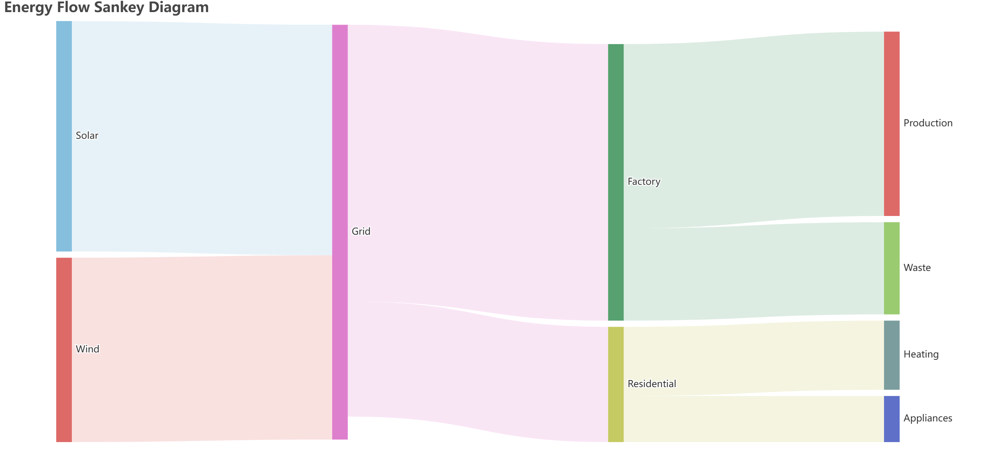
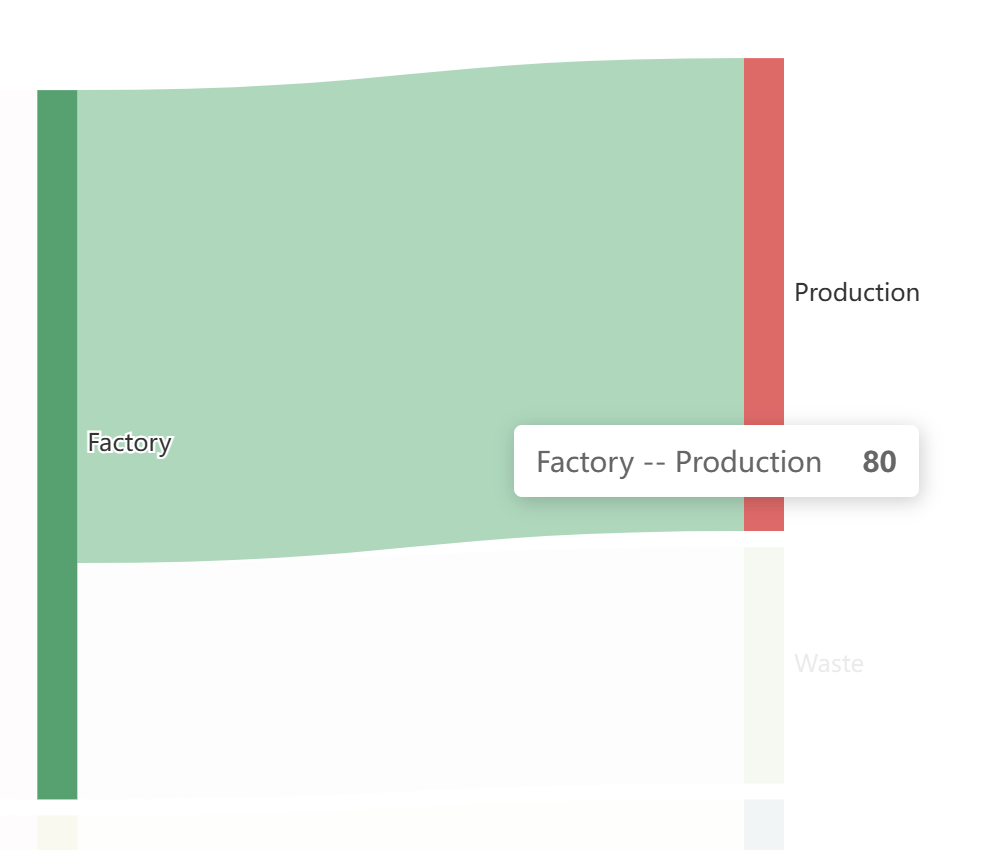

# Dask + ECharts + FastAPI Demo

This repository demonstrates a data pipeline using:
- **Dask** for parallelized dataframe processing.
- **Apache ECharts** for rendering a Sankey diagram.
- **FastAPI** as the backend API with a simple HTML frontend.

## Project Structure

    dask-echarts-fastapi-demo/
    ├── data/
    │   └── energy_flow.csv          # Synthetic dataset
    ├── src/
    │   ├── backend/
    │   │   ├── main.py             # FastAPI application
    │   │   └── data_processing.py  # Dask data processing
    │   └── frontend/
    │       └── index.html          # HTML frontend 
    ├── requirements.txt            # Python dependencies
    └── README.md

## Setup

1. Clone the repository:
   ```bash
   git clone https://github.com/pjlau/dask-echarts-fastapi-demo.git
   cd dask-echarts-fastapi-demo

2. Install dependencies:
   ```bash
   pip install -r requirements.txt

3. Run the FastAPI server:
   ```bash
   uvicorn src.backend.main:app --reload

- Open http://localhost:8000 in your browser to view the Sankey diagram.

- Verify the API endpoint by visiting http://localhost:8000/api/sankey-data.

## Results


<br>

